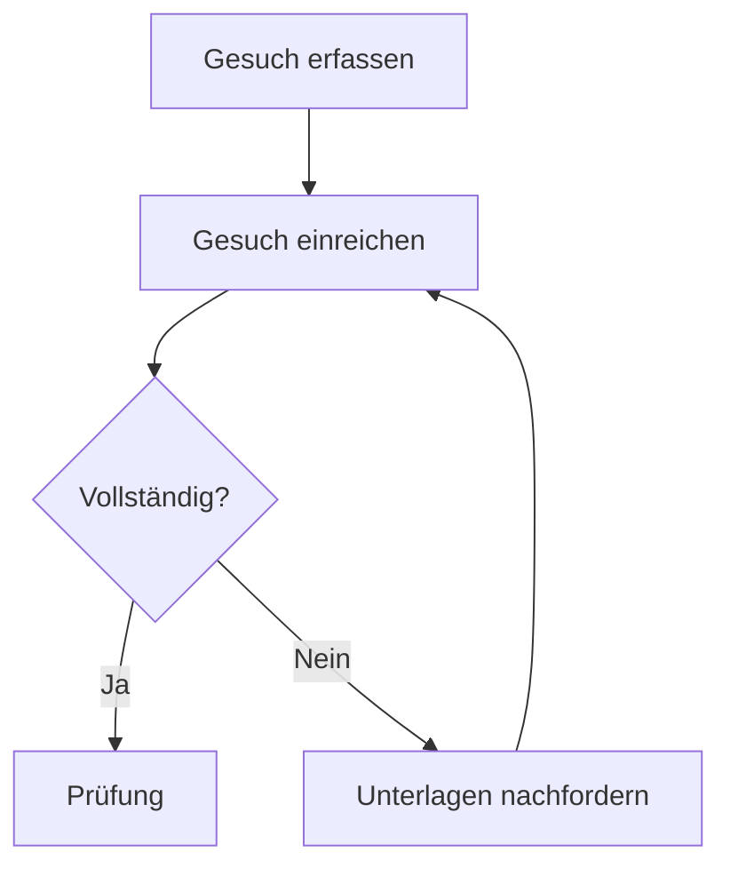

# Prozesse

Hier ist ein kleines Mermaid-Diagramm, das direkt aus Markdown dargestellt wird:

```mermaid
flowchart TD
    A[Gesuch erfassen] --> B[Gesuch einreichen]
    B --> C{Vollständig?}
    C -->|Ja| D[Prüfung]
    C -->|Nein| E[Unterlagen nachfordern]
    E --> B
```
